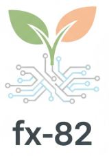

# 🐾 Ловец Мудов | Mood Catcher (Team fx-82)

<div align="center">



### *Интерактивный ИИ-помощник психоэмоционального состояния с тамагочи-капибарой, голосовым трекингом и тактильными практиками.*

[](LICENSE)
[](https://developer.mozilla.org/ru/docs/Web/JavaScript)
[](https://tailwindcss.com/)
[](https://supabase.com/)
[](https://groq.com/)
[](https://developer.mozilla.org/en-US/docs/Web/API/Web_Speech_API)
[](https://developer.mozilla.org/en-US/docs/Web/API/Vibration_API)

[**О проекте**](#-о-проекте) • [**Возможности**](#-ключевые-возможности) • [**Геймификация**](#-механика-капибары-тамагочи) • [**Стек**](#-стек-технологий) • [**Быстрый старт**](#-быстрый-старт) • [**База данных**](#-структура-базы-данных-supabase)

---

</div>

## 📖 О проекте

**«Ловец Мудов»** — это веб-приложение, созданное командой **fx-82** в рамках хакатона **Horizon Hackathon**. 

Проект решает проблему эмоционального выгорания, тревожности и хронического стресса через симбиоз **искусственного интеллекта**, **когнитивно-поведенческих методик** и **легкой игровой механики (тамагочи)**. Пользователь может выговориться голосом или текстом, после чего нейросеть мгновенно анализирует его психоэмоциональный баланс, даёт мудрый совет, ставит бережные квесты и синхронизирует состояние виртуального питомца — **Капибары**.

---

## ✨ Ключевые возможности

- 🎙️ **Голосовой дневник (Speech-to-Text):** Нажмите на микрофон и просто выскажите все свои мысли. Браузерный Web Speech API мгновенно переведет речь в текст на русском языке.
- 🧠 **Умный ИИ-анализ (Groq LLaMA 3.1):** Нейросеть за доли секунды рассчитывает метрики:
  - **Уровень стресса** (0–100%)
  - **Уровень энергии** (0–100%)
  - Персональный инсайт-поддержку («Совет Капибары»)
  - Карточки с практическими микро-рекомендациями
- 🦫 **Эмоциональное зеркало (Капибара-тамагочи):** Питомец реагирует на ваше состояние, меняя облик, настроение и цвет ауры.
- 📳 **Тактильное дыхание по квадрату (Box Breathing + Haptic API):** При критическом уровне стресса (>60%) приложение запускает дыхательную гимнастику (4 секунды вдох, 4 удержание, 4 выдох, 4 удержание), сопровождаемую пульсирующей вибрацией смартфона и плавной анимацией капибары.
- 🎮 **XP и прокачка уровней:** Забота о себе поощряется игровым опытом (+10 XP за анализ, +30 XP за антистресс-квесты).
- ☁️ **Облачная синхронизация (Supabase):** Бесшовная авторизация по email/паролю и сохранение истории настроения за последнюю неделю.
- 🎧 **Lofi-атмосфера:** Встроенные аудиодорожки (дождь, фортепиано, бас, Lo-Fi ритмы) для погружения и релаксации.

---

## 🎮 Механика Капибары-тамагочи

Капибара — центральный персонаж приложения. Ее состояние напрямую связано с психоэмоциональными маркерами пользователя:

| Состояние пользователя | Облик питомца | Свечение (Aura) | Реакция системы |
| :--- | :---: | :---: | :--- |
| **Высокий стресс (> 70%)** | `capybara (2).png` | 🔴 Красное | Активация квеста тактильного дыхания |
| **Усталость / Выгорание (Энергия < 30%)** | `capybara (3).png` | 🔵 Синее | Совет на отдых, микро-квесты на восстановление |
| **Дзен / Продуктивность (Стресс < 30%, Энергия > 70%)** | `capybara (4).png` | 🟢 Изумрудное | Похвала, закрепление ресурсного состояния |
| **Спокойный баланс (Норма)** | `capybara (1).png` | 🌿 Мятное | Стабильное состояние, базовые советы |

Каждые **100 XP** открывают новый уровень мудрости Капибары!

---

## 🗂 Структура репозитория

```bash
Horizon-Hack/
├── Horizon.png           # Официальный логотип приложения / команды
├── index.html            # Единый SPA-клиент (HTML5, Tailwind, JS Logic)
│
├── capybara.png          # Главная иллюстрация Капибары
├── capybara (1).png      # Базовое спокойное состояние
├── capybara (2).png      # Состояние тревоги / высокого стресса
├── capybara (3).png      # Состояние упадка сил / истощения
├── capybara (4).png      # Состояние счастья, ресурса и дзена
│
├── Lo-Fi.mp3             # Расслабляющий Lofi-бит
├── rain.mp3              # Атмосферный шум дождя
├── piano.mp3             # Успокаивающая партия фортепиано
└── bass.mp3              # Глубокий расслабляющий бас
